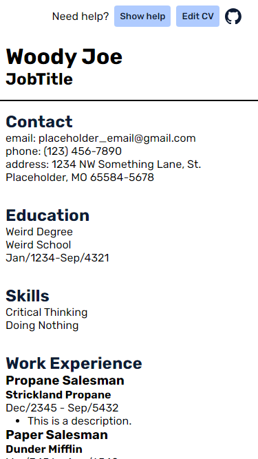
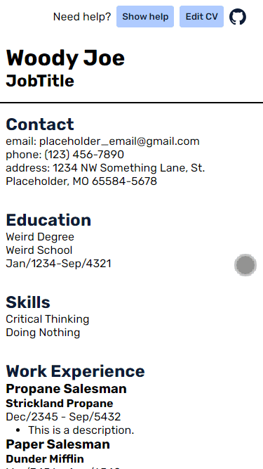

<!-- Improved compatibility of back to top link: See: https://github.com/othneildrew/Best-README-Template/pull/73 -->
<a name="readme-top"></a>
<!--
*** Thanks for checking out the Best-README-Template. If you have a suggestion
*** that would make this better, please fork the repo and create a pull request
*** or simply open an issue with the tag "enhancement".
*** Don't forget to give the project a star!
*** Thanks again! Now go create something AMAZING! :D
-->


<!-- PROJECT SHIELDS -->
<!--
*** I'm using markdown "reference style" links for readability.
*** Reference links are enclosed in brackets [ ] instead of parentheses ( ).
*** See the bottom of this document for the declaration of the reference variables
*** for contributors-url, forks-url, etc. This is an optional, concise syntax you may use.
*** https://www.markdownguide.org/basic-syntax/#reference-style-links
-->
<!-- [![Contributors][contributors-shield]][contributors-url] -->
<!-- [![Forks][forks-shield]][forks-url]
[![Stargazers][stars-shield]][stars-url]
[![Issues][issues-shield]][issues-url]
[![MIT License][license-shield]][license-url]
[![LinkedIn][linkedin-shield]][linkedin-url] -->


<!-- PROJECT LOGO -->
<br />
<div align="center">
  <a href="https://cvapplication-mikeycos.netlify.app/">
    
  </a>

<h3 align="center">CV Application</h3>

  <p align="center">
    CV Application with simple form validation.
    <br />
    <a href="https://cvapplication-mikeycos.netlify.app/">Live Preview</a>
    <!-- ·
    <a href="https://github.com/github_username/repo_name/issues/new?labels=bug&template=bug-report---.md">Report Bug</a>
    ·
    <a href="https://github.com/github_username/repo_name/issues/new?labels=enhancement&template=feature-request---.md">Request Feature</a> -->
    ·
    <a href="./CHANGELOG.md">Changelog</a>
  </p>
</div>


<!-- TABLE OF CONTENTS -->
<details>
  <summary>Table of Contents</summary>
  <ol>
    <li>
      <a href="#about-the-project">About The Project</a>
      <ul>
        <li><a href="#built-with">Built With</a></li>
      </ul>
    </li>
    <li>
      <a href="#getting-started">Getting Started</a>
      <ul>
        <li><a href="#prerequisites">Prerequisites</a></li>
        <li><a href="#installation">Installation</a></li>
      </ul>
    </li>
    <li><a href="#usage">Usage</a></li>
    <li><a href="#roadmap">Roadmap</a></li>
    <!-- <li><a href="#contributing">Contributing</a></li> -->
    <!-- <li><a href="#contact">Contact</a></li> -->
    <li><a href="#acknowledgments">Acknowledgments</a></li>
    <li><a href="#questions">Questions</a></li>
  </ol>
</details>


<!-- ABOUT THE PROJECT -->
## About The Project

[![CV Application Screen Shot][product-screenshot]](https://example.com)

Project: CV Application

Hello world,

This is exciting, my very first React project! Until now, I have been coding in vanilla JavaScript, and it feels like I have advanced into the Feudal Age or something alike.

I took some time thinking about how I wanted to approach this project using minimal repeatable code. I divided the project into five sections and into two states. The application can either be in a `true`/`false` `isEditing` state. If a user clicks on the "Edit CV" button, then the `isEditing` state will be `true`, otherwise, `isEditing` state will be `false`.

As much as I wanted to minimize repeatable code and maximized reusable code, I was not able to create a way for each section's state to update or set themselves the same way when `isEditing` is true. Some sections like "Work" updates it's state differently from other sections like "Header" or "Skills". For example, the `addSkillHandler` and `addWorkHandler` both add a skill/work object into their component's state. However, skills only have two object properties, `id` and `value`. The `value` property is what the user entered in the corresponding skill input. 

```js
const addSkillHandler = () => {
  const newSkill = { id: nextId++, value: skillsData.skill };
  setSkillsData({
    skill: '',
    skills: [...skillsData.skills, newSkill],
  });
};
```
versus
```js
const addWorkHandler = () => {
  const newWork = { ...workData.work, id: nextId++ };
  setWorkData({
    work: {
      ...initialWorkState.work,
    },
    works: [...workData.works, newWork],
  });
};
```

Notice, the `skill` property is not an object property while the `work` property is an object property. Small details like these can be seen in each section's defined event handlers that will impact their state. There is probably a solution to have flexible handlers in the parent component containing all sections, but I was not able to come up with a solution.

I attempted rendering delete pop ups near their button. At first, I tried using the `ResizeObserver` interface to make sure the pop up 'stays' near the button that triggered the pop up but with no avail, I was not able to resolve this issue. The pop up will 'stick' if the user vertically scrolls the window. 

Working with the `useState` React hook for the first time has been quite the endeavor, which made the project feel complex. There are few problems how and what happens during form validation. For example, the "header" section's inputs are small with no values, but if they fail validation, the inputs grow in width. Despite the pitfalls, I am satisfied with how the project turned out and I am looking forward to learning more about React.

To failing forward, cheers!

<p align="right">(<a href="#readme-top">back to top</a>)</p>


### Built With

* [![React][React.js]][React-url]
* 

<p align="right">(<a href="#readme-top">back to top</a>)</p>


<!-- GETTING STARTED -->
## Getting Started

To get a local copy up and running follow these simple example steps.

### Prerequisites

This is an example of how to list things you need to use the software and how to install them.
* npm
  ```sh
  npm install npm@latest -g
  ```

### Installation

1. Clone repository
      1. Clone [cv-application repository](https://github.com/mikeyCos/cv-application) using HTTPS/SSH/GitHub CLI; [more on cloning a repository](https://docs.github.com/en/repositories/creating-and-managing-repositories/cloning-a-repository).
      2. Navigate to cloned repository.
      3. Remove `.git` folder.
      4. Run `git init`.
      5. Run `git branch -M main`.
      6. Create a new repository on GitHub.
      7. Run `git remote add origin REPLACE_WITH_SSH_OR_HTTPS`.
      8. Run `git add . && git commit`.
2. Navigate to local repository and install NPM packages with `npm install`.

<p align="right">(<a href="#readme-top">back to top</a>)</p>


<!-- USAGE EXAMPLES -->
## Usage

Start by clicking on either "Show help" or "Edit CV" buttons. The "Show help" button will reveal a pop up with some instructions and placeholder text. Clicking the "Edit CV" button will render multiple forms, and the "Edit CV" button is now a "Submit CV" button. Fill out required inputs marked with two asterisks (**). Clicking the "Submit CV" button without filling out required inputs will reveal error messages below their respective inputs.
<div align="center">

  <!-- [![CV Application Gif][demo-overview-gif]](./demo/demo_overview.gif#center) -->

  <a href="./demo/demo_overview.gif">
    
  </a>

  _For more examples, please refer to the [Demo](./demo/DEMO.md)_
</div>

<p align="right">(<a href="#readme-top">back to top</a>)</p>


<!-- ROADMAP -->
## Roadmap

- [x] Initiate a skeleton
- [x] Allow users to add and remove items in education, skills, work, and references sections.
- [x] Change work description inputs into `textarea` elements.
    - [x] Ensure state is updated.
- [x] Split `FormItem` component module into separate component modules, i.e., `input`/`select`/`textarea`.
- [x] Implement basic form validation.
    - [x] If an input fails validation, attach an event listener to check if the input pass or fails validation while a user types.
    - [ ] Add an icon corresponding to an input's validity state.
    - [ ] Prevent user from entering the same values in "Date from" and "Date to" inputs.
- [x] Implement a delete-confirm modal, when a user clicks delete a modal appears to confirm or cancel the delete action.
    - [ ] Render the corresponding content in the modal, so the user is reminded what content is going to be deleted.
    - [ ] The pop ups need to stay near it's button that triggered it.
- [x] Implement an instructions modal; a user can toggle the modal to show or hide it's content.
- [ ] Make use of map while rendering similar components.
- [ ] Reset button should clear form error messages.

<p align="right">(<a href="#readme-top">back to top</a>)</p>


<!-- CONTACT -->
<!-- ## Contact

Your Name - [@twitter_handle](https://twitter.com/twitter_handle) - email@email_client.com

Project Link: [https://github.com/mikeyCos/cv-application](https://github.com/mikeyCos/cv-application)

<p align="right">(<a href="#readme-top">back to top</a>)</p> -->


<!-- ACKNOWLEDGMENTS -->
## Acknowledgments

* [Best README Template](https://github.com/othneildrew/Best-README-Template)
* []()
* []()

<p align="right">(<a href="#readme-top">back to top</a>)</p>


<!-- QUESTIONS -->
## Questions

1. Is it acceptable to create props conditionally? For example, I wanted to keep the `headerData` state separate from the props that are pass if `isEditing` is true, and, initially, I noticed I was repeating code.
```js
const [header, setHeader] = useState({
    firstName: { id: 0, label: 'First name', name: 'firstName', value: 'Firstname', type: 'text' },
    lastName: { id: 1, label: 'Last Name', name: 'lastName', value: 'Lastname', type: 'text' },
    jobTitle: {
      id: 2,
      label: 'Job Title',
      name: 'jobTitle',
      value: 'Cabbage Salesperson',
      type: 'text',
    },
  });
```
Instead, I went with this:
```js
const [headerData, setHeaderData] = useState({
    firstName: '',
    lastName: '',
    jobTitle: '',
  });
```
Now, if `isEditing` is true, then I create an array of object props for their respective inputs, and pass `propsForInputs` into my `Form` component.
```js
const propsForInputs =
    isEditing &&
    Object.keys(headerData).map((key, index) => ({
      id: index,
      label: keyToSentenceCase(key),
      name: key,
      value: headerData[key],
      type: 'text',
    }));
```
2. Is there a benefit for making a `FormItem` component and passing it's respective properties versus hardcoding a form item's content where it is needed? For example:
```js
<FormItem
  {...{
    id: `companyName_${work.id}`,
    value: work.companyName,
    name: 'companyName',
    onChange: onChangeHandler,
  }}
  dataAttributes={{
    'data-id': work.id,
    'data-key': 'works',
  }}
/>
// versus
<li data-id={work.id} className="form-item">
  <label htmlFor={`companyName_${work.id}`}>Company name:</label>
  <input
    id={`companyName_${work.id}`}
    value={work.companyName}
    type="text"
    name="companyName"
    onChange={onChangeHandler}
    data-id={work.id}
    data-key="works"
  />
</li>
```
3. Lorem ipsum

<p align="right">(<a href="#readme-top">back to top</a>)</p>


<!-- MARKDOWN LINKS & IMAGES -->
<!-- https://www.markdownguide.org/basic-syntax/#reference-style-links -->

[contributors-shield]: https://img.shields.io/github/contributors/github_username/repo_name.svg?style=for-the-badge
[contributors-url]: https://github.com/github_username/repo_name/graphs/contributors
[forks-shield]: https://img.shields.io/github/forks/github_username/repo_name.svg?style=for-the-badge
[forks-url]: https://github.com/github_username/repo_name/network/members
[stars-shield]: https://img.shields.io/github/stars/github_username/repo_name.svg?style=for-the-badge
[stars-url]: https://github.com/github_username/repo_name/stargazers
[issues-shield]: https://img.shields.io/github/issues/github_username/repo_name.svg?style=for-the-badge
[issues-url]: https://github.com/github_username/repo_name/issues
[license-shield]: https://img.shields.io/github/license/github_username/repo_name.svg?style=for-the-badge
[license-url]: https://github.com/github_username/repo_name/blob/master/LICENSE.txt
[linkedin-shield]: https://img.shields.io/badge/-LinkedIn-black.svg?style=for-the-badge&logo=linkedin&colorB=555
[linkedin-url]: https://linkedin.com/in/linkedin_username
[product-screenshot]: ./src/assets/media/project_screenshot_01.png
[Next.js]: https://img.shields.io/badge/next.js-000000?style=for-the-badge&logo=nextdotjs&logoColor=white
[Next-url]: https://nextjs.org/
[React.js]: https://img.shields.io/badge/React-20232A?style=for-the-badge&logo=react&logoColor=61DAFB
[React-url]: https://reactjs.org/
[Vue.js]: https://img.shields.io/badge/Vue.js-35495E?style=for-the-badge&logo=vuedotjs&logoColor=4FC08D
[Vue-url]: https://vuejs.org/
[Angular.io]: https://img.shields.io/badge/Angular-DD0031?style=for-the-badge&logo=angular&logoColor=white
[Angular-url]: https://angular.io/
[Svelte.dev]: https://img.shields.io/badge/Svelte-4A4A55?style=for-the-badge&logo=svelte&logoColor=FF3E00
[Svelte-url]: https://svelte.dev/
[Laravel.com]: https://img.shields.io/badge/Laravel-FF2D20?style=for-the-badge&logo=laravel&logoColor=white
[Laravel-url]: https://laravel.com
[Bootstrap.com]: https://img.shields.io/badge/Bootstrap-563D7C?style=for-the-badge&logo=bootstrap&logoColor=white
[Bootstrap-url]: https://getbootstrap.com
[JQuery.com]: https://img.shields.io/badge/jQuery-0769AD?style=for-the-badge&logo=jquery&logoColor=white
[JQuery-url]: https://jquery.com
[demo-overview-gif]: ./demo/demo_overview.gif